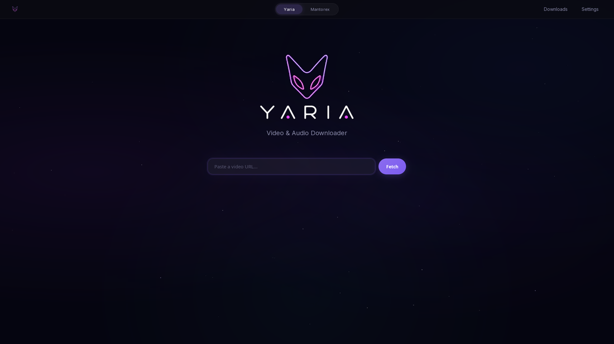

<!-- banner -->
<p align="center">
  
</p>

<h1 align="center">Yaria</h1>

<p align="center">
  <b>Desktop video &amp; audio downloader</b> for Linux and Windows<br/>
  Free forever · Pro media tools when you want them
</p>

<p align="center">
  <a href="https://yaria.live"></a>
  <a href="https://yaria.live/download"></a>
  <a href="https://yaria.live/docs"></a>
</p>

<p align="center">
  
  
  
  
  
</p>

---

## ✨ Demo

<p align="center">
  
</p>
<p align="center"><sub>Paste a URL, pick a format, download</sub></p>

---

## 🚀 Why Yaria?

| | |
|:--|:--|
| 🎬 | **1000+ sites** via yt-dlp (YouTube, Instagram, TikTok, X, Vimeo, …) |
| ⚡ | **Fast downloads** with aria2 multi-connection |
| 🖥️ | **Real desktop app**, not only a terminal tool |
| 🔒 | **Your machine, your files** (no account required for free use) |
| 🧩 | **Pro optional**: torrents, local library, remote shares, home server |

---

## 📦 Install

<details open>
<summary><b>Linux</b> (one-liner)</summary>

```bash
curl -fsSL https://yaria.live/install.sh | bash
export PATH="$HOME/.local/bin:$PATH"
yaria-app
```

Installs to `~/.local/bin` + desktop entry.  
First run may ask once for permission to install **WebKitGTK** if missing.

</details>

<details open>
<summary><b>Windows</b></summary>

1. Download [yaria-app-windows-amd64.zip](https://yaria.live/download/yaria-app-windows-amd64.zip)
2. Extract → run `yaria-app.exe`
3. Needs [WebView2](https://developer.microsoft.com/microsoft-edge/webview2/) (usually already installed)

</details>

<p align="center">
  <a href="https://yaria.live/download"></a>
</p>

---

## ✨ Features

<table>
<tr>
<td width="50%" valign="top">

### 🆓 Free

- Video / audio download  
- Format & resolution picker  
- Audio-only & containers  
- Queue & history  
- Auto tools: yt-dlp, aria2, ffmpeg, deno  
- WebView or native mpv  
- Themes, fonts, startup tab  
- In-app updates  

</td>
<td width="50%" valign="top">

### 💎 Pro (Mantorex)

- Torrent search & streaming  
- Local media library  
- Continue watching  
- Remote sources (SSH / SMB)  
- Library backup / restore  
- LAN media server & DLNA  
- 30-day trial in the app  

</td>
</tr>
</table>

---

## 💻 Platforms

| OS | UI engine | Status |
|:--|:--|:--|
| **Linux** | WebKitGTK 4.1 | ✅ amd64 / arm64 |
| **Windows** | WebView2 | ✅ amd64 |
| **macOS** | WKWebView | 🔜 official packages soon |

---

## 🔧 Dependencies

### UI (required)

| | Linux | Windows |
|--|:--|:--|
| Webview | **WebKitGTK 4.1** + GTK 3 | **WebView2** |

Linux launcher auto-tries install on Arch, Ubuntu/Debian, Fedora, openSUSE, and more.

### Tools (fetched on first need)

`~/.yaria/dependencies/` · Windows: `%USERPROFILE%\.yaria\dependencies\`

| Tool | Role |
|:--|:--|
| **yt-dlp** | Site extraction |
| **aria2c** | Multi-connection speed |
| **ffmpeg** | Merge / remux |
| **deno** | JS challenges |
| **mpv / libmpv** | Optional native player |

WebView player works even if mpv is missing.

<details>
<summary>🔧 Manual WebKit (Linux only)</summary>

```bash
# Arch / CachyOS
sudo pacman -S webkit2gtk-4.1 gtk3

# Debian / Ubuntu
sudo apt update && sudo apt install libwebkit2gtk-4.1-0 libgtk-3-0

# Fedora
sudo dnf install webkit2gtk4.1 gtk3

# openSUSE
sudo zypper install libwebkit2gtk-4_1-0 libgtk-3-0
```

</details>

---

## ⚙️ Defaults & config

| Setting | Default |
|:--|:--|
| Font | Roboto (bundled) |
| Animations | Off |
| Startup tab | Yaria |
| Player | WebView |

📄 Config: `~/.config/yaria/app.toml`  
📁 Data: `~/.yaria/`

---

## 🛠️ Build from source

**Need:** Go · Node/npm · Linux: WebKitGTK 4.1 + GTK **dev** packages

```bash
cd frontend && npm install && npm run build && cd ..

make build        # free
make build-pro    # Mantorex (needs Pro sources)

make dev
make dev-pro
```

Cross-build: `make build-linux` · `build-windows` · `build-darwin` · `build-all` (+ `-pro`)

```bash
go install github.com/wailsapp/wails/v2/cmd/wails@v2.13.0
```

### Project layout

```text
YariaApp/
├── main.go, *_service.go   # backend
├── *_stub.go               # free-build Pro API stand-ins
├── frontend/               # Svelte UI
├── packaging/              # install.sh, launcher, icons
├── assets/                 # README images
└── Makefile
```

---

## 🐧 Linux package layout

| File | Role |
|:--|:--|
| `yaria-app` | Launcher (WebKit check → start) |
| `yaria-app.bin` | Real binary |
| `linux-deps.sh` | Distro helpers |
| `icons/` | App icons |

---

## 💡 Contributor tips

- Build tag **`pro`** enables Mantorex when sources are present  
- Pro UI loads via `import.meta.glob` only if files exist at build time  
- Don’t commit secrets or private keys  
- Keep Wails CLI version in sync with `go.mod`

---

## 📄 License

Free Yaria is open source in this repository.  
Pro / Mantorex is available from [yaria.live](https://yaria.live).

---

<p align="center">
  <br/><br/>
  <b>Your media tools. On your machine.</b><br/>
  <a href="https://yaria.live">yaria.live</a>
  ·
  <a href="https://yaria.live/download">Download</a>
  ·
  <a href="https://yaria.live/docs">Docs</a>
</p>
